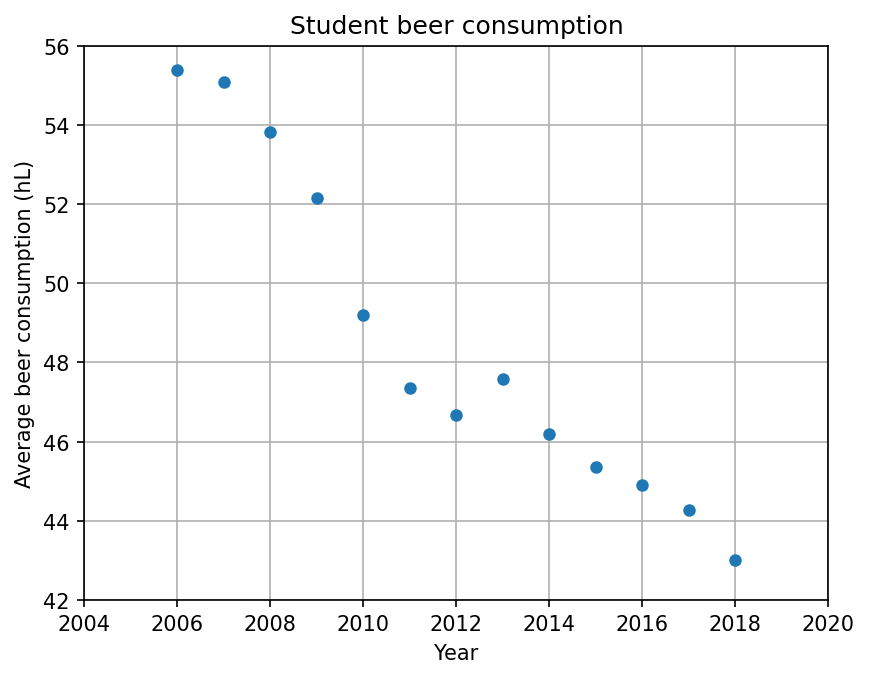

# Toolbox Assignment

## StudentID: 14535734

## Articles
* Fantastic yeasts and where to find them: the hidden diversity of dimorphic fungal pathogens (MCC Van Dyke et al., 2019)
* An analysis of the forces required to drag sheep over various surfaces (JT Harvey, Applied Ergonomics, 2002) 
* The neurocognitive effects of alcohol on adolescents and college students (DW Zeigler et al., 2005)

## Analysis of student beer consumption

### Import and save data in DataFrame
```python
# Import necessary pakages
import pandas as pd
import matplotlib.pyplot as plt

# Read csv data
df = pd.read_csv("istherecorrelation.csv", sep = ";", decimal = ",")

# Add column with average beer consumption
df["Average consumption [hL]"] = df["NL Beer consumption [x1000 hectoliter]"] / df["WO [x1000]"]
```

### Plot average beer consumption (in hL) per year
```python
# Plot data
plt.figure(dpi = 300)
plt.plot(df["Year"], df["Average consumption [hL]"], 'o', markersize = 5)

# Change plot properties
plt.grid(True)
plt.xlabel("Year (a.u.)")
plt.ylabel("Average beer consumption (hL)")
plt.xlim(2004, 2020)
plt.ylim(42, 56)

plt.show()
```

### Figure beer consumption


### Short interpretation of results
The graph shows a decreasing linear trend in average beer consumption. Thus, on average, students in the Netherlands drink less beer.